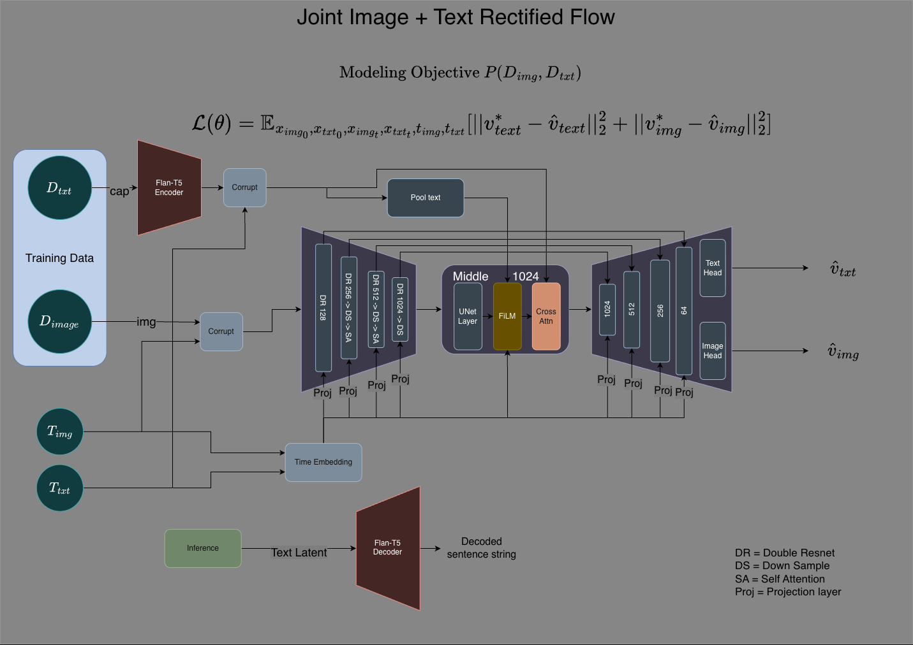
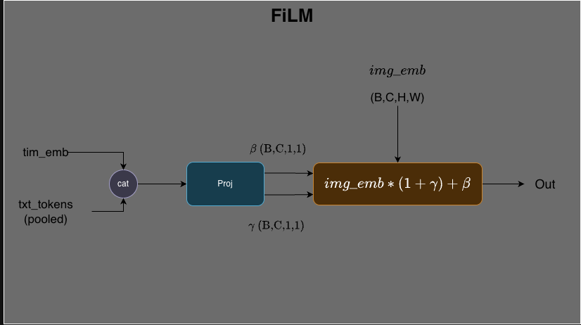
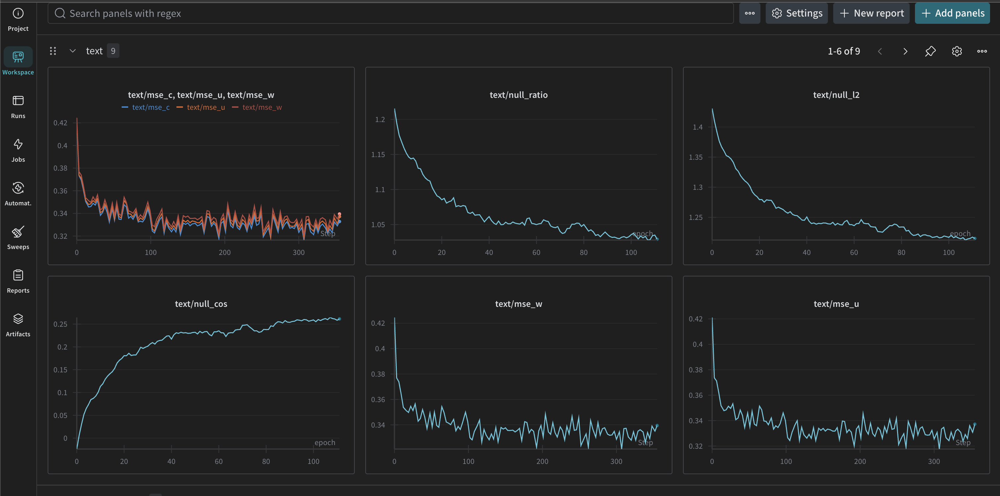
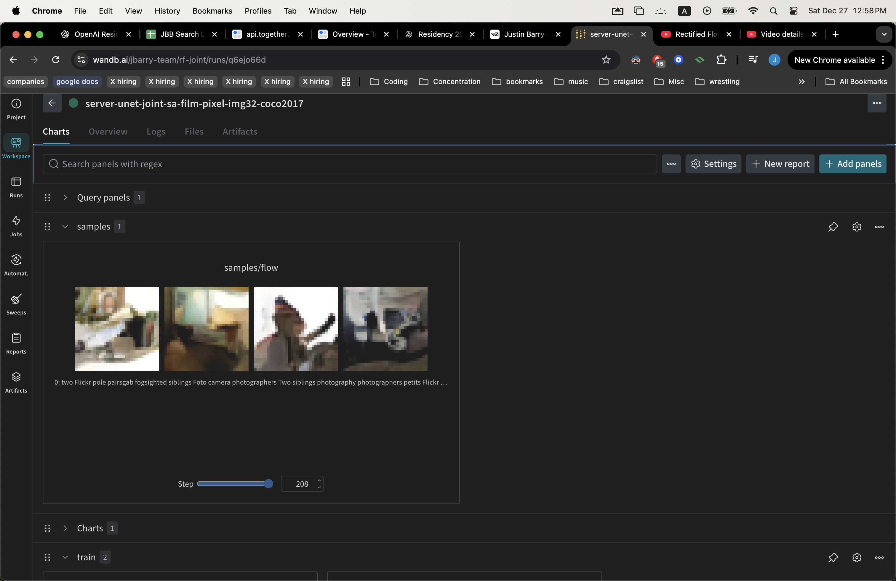

# Rectified Flow: Joint Image-Text Generative Models

A research implementation of **Rectified Flow** for joint image and text generation, featuring state-of-the-art cross-modal conditioning techniques and production-ready training infrastructure.

## Overview

This project implements rectified flow models for multimodal generation, with a focus on **joint image-text modeling**. Unlike traditional text-to-image models that generate only images from text, this implementation learns to simultaneously generate both modalities in a unified framework.

### Key Innovation: Joint Modeling

The flagship model (`UNetPixelJointCAFiLM`) learns the joint distribution `P(image, text)` by predicting velocity fields for **both** images and text embeddings during the diffusion process. This enables:

- Coherent multimodal generation
- Bidirectional image-text editing
- Better-aligned vision-language representations
- Novel applications in creative tools and multimodal AI

## Architecture Diagram



*Detailed view of the modeling objective: `L(θ) = E[||v_text - v_text*||² + ||v_img - v_img*||²]`*

The diagram illustrates the complete training pipeline: dual data flows (images and text), separate time embeddings, the UNet backbone with FiLM and Cross-Attention conditioning at the bottleneck, and dual velocity prediction heads for both modalities.

## Architecture Highlights

### 1. Hybrid Cross-Modal Conditioning

The model employs a sophisticated dual-conditioning mechanism:

**FiLM (Feature-wise Linear Modulation)**



- Modulates image features using pooled text representations
- Learns scale (γ) and shift (β) parameters from concatenated text and time embeddings
- Zero-initialized projections for stable training
- Applied at the bottleneck layer for maximum effect
- Formula: `img_emb * (1 + γ) + β`

**Cross-Attention**
- Enables fine-grained text-to-image alignment
- Supports variable-length text sequences with attention masking
- Gated contribution (`ca_gate`) initialized at 0.0 for gradual learning
- Xavier initialization with small gain (1e-3) to prevent training collapse

**Dual Time Embeddings**
- Separate timestep encodings for image (`t_img`) and text (`t_txt`)
- Fused through learned MLP for joint conditioning
- Allows independent noise schedules for each modality

### 2. UNet Architecture

**4-Level Encoder-Decoder**
```
Input (3×32×32) → 128 → 256 → 512 → 1024 (bottleneck)
                    ↓     ↓     ↓      ↓
                  Skip connections + Upsampling
```

**Key Features:**
- Strategic self-attention at deeper layers (256+ channels) for efficiency
- Adaptive Group Normalization (AdaGN) in ResNet blocks
- Double ResNet blocks per level for increased capacity
- Total parameters: ~100M

### 3. Text Velocity Head

A novel component that predicts text embedding changes conditioned on visual context:

```python
class TxtVelocityHead:
    Input: [text_tokens, pooled_image_features]
    Output: text_velocity [B, L, txt_dim]
```

This enables the model to:
- Update text embeddings coherently with image generation
- Learn cross-modal dependencies
- Generate semantically aligned image-text pairs

### 4. Classifier-Free Guidance (CFG)

Production-ready CFG implementation featuring:
- **Learnable null token** instead of fixed zeros
- Conditional dropout during training
- Runtime guidance scale control
- Initialized with `std=0.02` for stable unconditional generation

## Technical Stack

**Framework & Libraries:**
- PyTorch 2.7.0 with CUDA support
- Hugging Face Transformers & Diffusers
- T5 text encoder (512-dim embeddings)
- Weights & Biases for experiment tracking

**Data Pipeline:**
- Flickr30k dataset (30,000 image-caption pairs)
- Custom data loading with attention masking
- Support for latent precomputation (VAE caching)

**Training Infrastructure:**
- Multi-GPU support via PyTorch DDP
- A100 GPU training on cloud infrastructure (RunPod)
- Gradient checkpointing for memory efficiency
- Mixed precision training (FP16)

## Model Zoo

This repository includes multiple model architectures, showcasing iterative research:

| Model | Description | Key Features |
|-------|-------------|--------------|
| `unet_pixel_space_joint_sa_film.py` | **Main model** - Joint image-text RF | FiLM + Cross-Attention, CFG |
| `joint_dit.py` | DiT-based joint model | Transformer backbone |
| `joint_film_cross_attn.py` | Standalone FiLM+CA implementation | Ablation study variant |
| `unet_pixel_space_sa_tc.py` | Text-conditioned image-only UNet | Baseline comparison |
| `unet_latent_space.py` | Latent diffusion variant | VAE latent space |

**20+ training scripts** covering different architectures, datasets, and conditioning strategies.

## Results

### Experimental Setup & Limitations

This project was conducted with limited computational resources (single A100 GPU) as a proof-of-concept implementation. Key constraints:

**Resolution Trade-off:**
- Images downsampled to **32×32 pixels** to enable faster iteration and feasibility on single GPU
- This resolution limit meant the model could only learn low-frequency features (blurry reconstructions)
- In retrospect, training on 512×512 with gradient accumulation may have been preferable despite slower iteration

**Training Strategy:**
- Image and text paths trained **jointly from scratch**
- Limited training budget (~few days on single A100) prevented full convergence
- Text generation quality limited by insufficient training steps

**What Worked:**
- Architecture compiled and trained without errors
- Loss curves showed stable convergence (no divergence, NaN issues, or mode collapse)
- CFG implementation functional
- Cross-modal conditioning mechanisms integrated successfully

### Training Metrics



The model shows stable gradient flow and decreasing loss, validating the architectural design despite limited compute.

#### Text Conditioning Diagnostics

Since the model wasn't producing legible text outputs, custom diagnostic metrics were implemented to verify whether text conditioning was actually working. These metrics probe the model's internal representations:

**Triplet Comparison Metrics** (`text_triplet_metrics`)

These measure whether the model uses text information by comparing three conditioning scenarios on the same noisy image:

- **`mse_c`** - Loss with **correct** caption (baseline)
- **`mse_u`** - Loss with **unconditional** generation (null token via CFG)
- **`mse_w`** - Loss with **wrong** caption (randomly shuffled)

**Delta Metrics** (the key indicators):
- **`delta_u = mse_u - mse_c`** - Should be **positive** if text helps (unconditional should be worse)
- **`delta_w = mse_w - mse_c`** - Should be **positive** if model distinguishes captions (wrong caption should be worse)

If `delta_u > 0` and `delta_w > 0`, the model is using text conditioning. If both are near zero, text is being ignored.

**Null Token Collapse Metrics** (`null_proximity_stats`)

These detect if the learnable null token is collapsing onto the real text embeddings (a failure mode):

- **`null_cos`** - Cosine similarity between null token and real text (pooled at EOT)
  - Range: -1 to 1, where 1 = identical
  - **Should be low** (<0.5) for healthy separation

- **`null_l2`** - L2 distance in normalized embedding space
  - **Should be large** (>1.0) for good separation

- **`null_ratio`** - Scale-free distance metric: `dist(text, null) / mean_pairwise_dist(texts)`
  - **Most reliable metric** (handles varying embedding magnitudes)
  - Should be **≈1.0 or higher** (null as far from texts as texts are from each other)
  - If <0.5, null token is collapsing toward the text manifold

**Why This Matters:**

These metrics allowed debugging the text conditioning path without needing legible outputs. They revealed:
- Whether the FiLM and Cross-Attention layers were actually being used
- If the null token was learning a distinct "unconditional" representation
- Whether the model could discriminate between different captions

This diagnostic approach is standard practice in conditional generation research when training on limited compute—you verify the *mechanism* works before expecting high-quality results.

### Generated Samples



*Note: Generations are low-resolution (32×32) and blurry due to computational constraints. These samples demonstrate architectural feasibility rather than final quality.*

### Lessons Learned & Improved Training Strategy

The ideal training approach identified through this experiment:

1. **Stage 1: Image Path Pretraining**
   - Train only the image generation path (UNet backbone + image head)
   - Use 512×512 resolution on larger dataset
   - Train to convergence on high-quality reconstructions
   - Freeze these weights

2. **Stage 2: Text Conditioning**
   - Add and train only the text-conditional components (FiLM, Cross-Attention, Text Velocity Head)
   - Keep image backbone frozen
   - Focus compute on learning cross-modal alignment

3. **Stage 3: Joint Fine-tuning**
   - Unfreeze all weights
   - Fine-tune end-to-end with lower learning rate
   - Requires multi-GPU setup for practical training time

This staged approach would address the compute limitations while maintaining the architectural innovations demonstrated in this implementation.

## Research Techniques Implemented

### Advanced Training Methods
- **AdaGN (Adaptive Group Normalization)**: Time-conditional normalization in ResNet blocks
- **Pre-normalization**: Residual connections with LayerNorm for training stability
- **Smart initialization**: Zero-init for additive components, small Xavier for gated paths
- **Attention masking**: Proper handling of variable-length sequences

### Architectural Innovations
- **Dual timesteps**: Independent noise schedules for each modality
- **Learnable null embeddings**: Better unconditional generation than fixed zeros
- **Residual gating**: Smooth integration of cross-attention contributions
- **Pooled text conditioning**: Global context via masked averaging

### Engineering Excellence
- **Modular design**: Clean separation of components (ResNet, Attention, FiLM, etc.)
- **Efficient attention**: Self-attention only at coarser resolutions
- **Memory optimization**: Gradient checkpointing, latent caching
- **Reproducibility**: Seed control, config management via OmegaConf

## Infrastructure & Tooling

### Configuration Management

The project uses a hierarchical YAML-based configuration system powered by OmegaConf, enabling seamless switching between local development and cloud training:

**Three-tier configuration:**
```
config/train_unet_pixel_space_joint/
├── base.yaml        # Shared hyperparameters (seed, learning rate, model arch)
├── local.yaml       # Development settings (small batch, CPU workers, wandb disabled)
└── server.yaml      # Production settings (large batch, multi-worker, GPU optimized)
```

**Example configuration** ([config/train_unet_pixel_space_joint/server.yaml](config/train_unet_pixel_space_joint/server.yaml)):
```yaml
env_name: server
data_root: /workspace/data
batch_size: 256
num_workers: 8
pin_memory: True
n_epochs: 300
guidance_scale: 8.0
save_model: True
wandb_mode: online
```

**Usage:**
```bash
# Local development with minimal resources
python train.py  # uses local.yaml

# Cloud training with full settings
ENV=server python train.py  # merges base.yaml + server.yaml
```

**Benefits:**
- Single command switches between environments
- No hardcoded paths or hyperparameters in code
- Easy experimentation (change config, not code)
- Reproducible experiments (config saved to W&B)

### Google Drive Model Checkpointing

Custom Google Drive integration ([rectified_flow/utils/gdrive_io.py](rectified_flow/utils/gdrive_io.py)) for automatic checkpoint persistence on ephemeral cloud VMs:

**Key Features:**
- **OAuth2 device flow** authentication (works over SSH/headless)
- **Automatic folder creation** with nested paths
- **Checkpoint versioning** (updates existing files in-place or creates new)
- **Resumable uploads** for large model files
- **Token caching** to avoid repeated auth

**Implementation:**
```python
# In training loop
service = gdio.auth_drive("client_secret.json", "token.json")

if epoch % config.save_interval == 0:
    gdio.save_and_upload_model(
        service, model, config,
        drive_path=f"rf_ckpts/{config.name}",
        filename="best-model.pth"
    )
```

**Why This Matters:**

Cloud VM instances (RunPod, Lambda Labs) have **ephemeral storage**—everything is lost when the instance stops. Manual checkpoint management is error-prone during multi-day training runs.

This solution:
- **Automatic persistence** after each epoch/milestone
- **No manual intervention** during training
- **Version control** for model weights
- **Fault tolerance** if VM crashes mid-training

Inspired by production ML practices at scale, where automated artifact management is critical for long-running experiments.

## Code Quality

**Well-Structured Codebase:**
- Clean PyTorch implementation (~300 lines for main model)
- Proper abstraction layers (models, training, data, encoders)
- Environment-aware configuration system (local/server/test)
- GPU memory-efficient implementations

**Research-Ready:**
- Multiple model variants for ablation studies
- Experiment tracking with W&B
- Detailed architectural diagrams
- Iterative development visible in git history
- Production-grade checkpoint management

## Installation

```bash
# Clone repository
git clone <repo-url>
cd rectified-flow

# Install dependencies (Poetry)
poetry install

# For development on cloud GPUs
# See setup instructions for RunPod A100 configuration
```

### Requirements
- Python 3.13
- CUDA-capable GPU (recommended: A100 with 40GB+ VRAM)
- 50GB+ storage for datasets and checkpoints

## Usage

### Training

```bash
# Train joint image-text model
poetry run python rectified_flow/training/train_unet_pixel_space_joint_live.py

# Train with custom config
ENV=server poetry run python rectified_flow/training/train_unet_pixel_space_joint_live.py
```

### Inference

```python
from rectified_flow.models.unet_pixel_space_joint_sa_film import UNetPixelJointCAFiLM

# Load model
model = UNetPixelJointCAFiLM(in_ch=3, time_dim=128).cuda()
model.load_state_dict(torch.load('checkpoint.pt'))

# Joint generation (images + text)
v_img_pred, v_txt_pred = model(
    x_img_t, x_txt_t,
    t_img, t_txt,
    attn_mask=mask,
    is_uncond=None  # CFG control
)
```

## Project Structure

```
rectified-flow/
├── rectified_flow/
│   ├── models/              # 15+ model architectures
│   ├── training/            # 20+ training scripts
│   ├── data/                # Data loading & preprocessing
│   └── encdec/              # Text encoders (T5, etc.)
├── config/                  # YAML configurations
├── notes/                   # Architecture diagrams
├── results/                 # Training outputs & samples
└── README.md
```

## Key Contributions

This project demonstrates:

1. **Novel Architecture**: Joint image-text rectified flow with dual velocity prediction
2. **Advanced Conditioning**: Hybrid FiLM + Cross-Attention with smart initialization
3. **Production ML**: Full training pipeline with CFG, experiment tracking, cloud GPUs
4. **Research Rigor**: Multiple variants, ablation studies, thorough documentation
5. **Engineering Quality**: Clean code, modular design, reproducible experiments

## Technical Depth

**Diffusion Theory:**
- Rectified flow formulation (straight-line paths in probability space)
- Velocity field prediction vs. noise prediction
- Euler integration for sampling

**Vision-Language:**
- T5 text embeddings
- Cross-modal attention mechanisms
- Semantic alignment techniques

**Deep Learning:**
- Transformer architectures
- Residual connections & normalization
- Gradient flow optimization
- Training dynamics & stability

## Future Directions

Potential extensions:
- [ ] Higher resolution generation (256×256, 512×512)
- [ ] Latent diffusion variant for efficiency
- [ ] Text-to-image editing applications
- [ ] Integration with larger text models (T5-XL, CLIP)
- [ ] Distillation for faster sampling
- [ ] Multi-GPU distributed training

## References

This implementation draws on techniques from:
- **Rectified Flow** - Liu et al., "Flow Straight and Fast: Learning to Generate and Transfer Data with Rectified Flow"
- **Denoising Diffusion Models** - Ho et al., "Denoising Diffusion Probabilistic Models"
- **Classifier-Free Guidance** - Ho & Salimans, "Classifier-Free Diffusion Guidance"
- **FiLM** - Perez et al., "FiLM: Visual Reasoning with a General Conditioning Layer"
- **Stable Diffusion** - Rombach et al., "High-Resolution Image Synthesis with Latent Diffusion Models"
- **Attention Is All You Need** - Vaswani et al.

### Related Work

**OmniFlow: Any-to-Any Generation with Multi-Modal Rectified Flows** (Li et al., 2024)
[arXiv:2412.01169](https://arxiv.org/abs/2412.01169)

*Note: This work was developed independently and concurrently with OmniFlow. While both explore joint multimodal generation with rectified flows, this implementation takes a different architectural approach with its hybrid FiLM + Cross-Attention conditioning and dual velocity prediction heads. OmniFlow extends the MMDiT architecture from Stable Diffusion 3 for any-to-any generation (including audio), while this project focuses on joint image-text modeling with UNet-based architectures.*

## License

MIT License - see LICENSE file for details

## Citation

If you use this code in your research, please cite:

```bibtex
@software{rectified_flow_joint,
  author = {Justin Barry},
  title = {Rectified Flow: Joint Image-Text Generative Models},
  year = {2025},
  url = {https://github.com/yourusername/rectified-flow}
}
```


## Acknowledgments

- Trained on NVIDIA A100 GPUs via RunPod
- Flickr30k dataset for image-caption pairs
- Hugging Face for model implementations
- Weights & Biases for experiment tracking

---

**Built with:** PyTorch | Transformers | Diffusers | W&B

**Research Areas:** Generative AI | Multimodal Learning | Diffusion Models | Vision-Language
